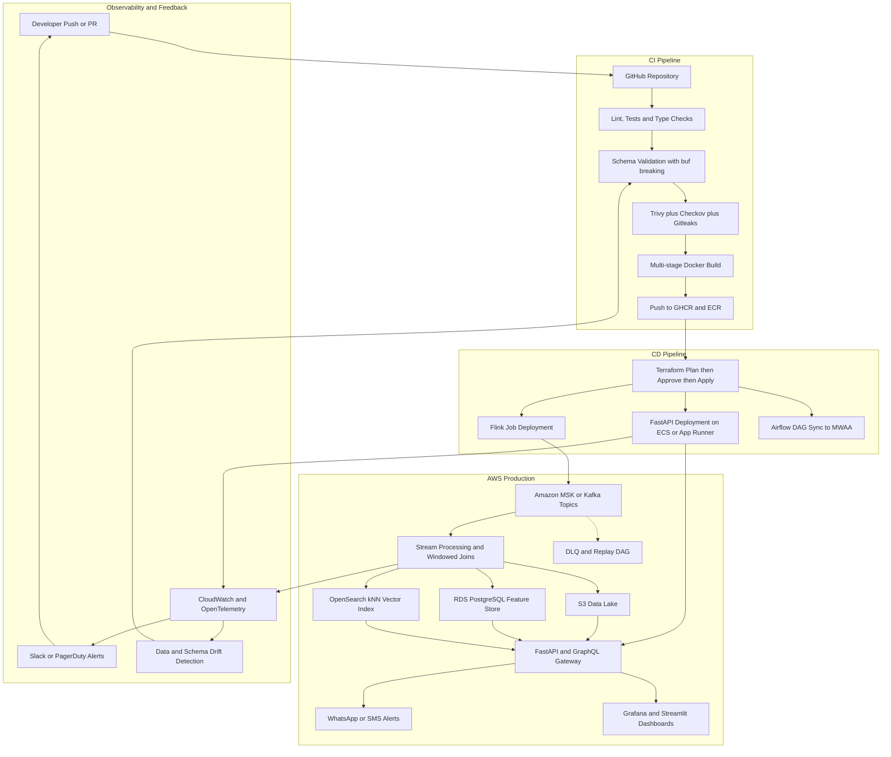

# CI to CD to Architecture Flow

```mermaid
flowchart TD
  Dev[Developer Push or PR] --> GitHub[GitHub Repository]

  subgraph CI Pipeline
    GitHub --> Lint[Lint, Tests and Type Checks]
    Lint --> Schema[Schema Validation with buf breaking]
    Schema --> Sec[Trivy plus Checkov plus Gitleaks]
    Sec --> Build[Multi-stage Docker Build]
    Build --> Push[Push to GHCR and ECR]
  end

  subgraph CD Pipeline
    Push --> IaC[Terraform Plan then Approve then Apply]
    IaC --> DeployAPI[FastAPI Deployment on ECS or App Runner]
    IaC --> DeployFlink[Flink Job Deployment]
    IaC --> SyncDAGs[Airflow DAG Sync to MWAA]
  end

  subgraph AWS Production
    DeployFlink --> MSK[Amazon MSK or Kafka Topics]
    MSK --> Proc[Stream Processing and Windowed Joins]
    Proc --> S3[S3 Data Lake]
    Proc --> RDS[RDS PostgreSQL Feature Store]
    Proc --> VDB[OpenSearch kNN Vector Index]

    DeployAPI --> GQL[FastAPI and GraphQL Gateway]
    S3 --> GQL
    RDS --> GQL
    VDB --> GQL

    GQL --> WA[WhatsApp or SMS Alerts]
    GQL --> Dash[Grafana and Streamlit Dashboards]
    MSK -.-> DLQ[DLQ and Replay DAG]
  end

  subgraph Observability and Feedback
    DeployAPI --> CW[CloudWatch and OpenTelemetry]
    Proc --> CW
    CW --> Alerts[Slack or PagerDuty Alerts]
    Alerts --> Dev
    CW --> Drift[Data and Schema Drift Detection]
    Drift --> Schema
  end
```
