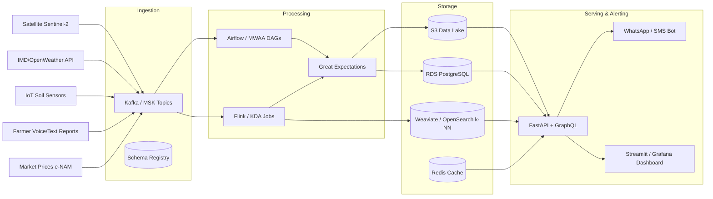

# 🌾IndicAgri-Stream
> **Real-time, event-driven agricultural intelligence pipeline for smallholder farmers**  
`[Pub/Sub Architecture]` `[Event-Driven]` `[AWS-Ready]` `[Indic NLP]` `[Production-Grade DE]`

[](https://opensource.org/licenses/MIT)
[](https://www.python.org/downloads/)
[](https://www.docker.com/)
[](https://aws.amazon.com/)
[](https://github.com/yourname/indicagri-stream/actions)

---

## 📖 Overview

**The Problem:** 86% of Indian farmers operate on <2 hectares and make reactive decisions due to fragmented, delayed signals (satellite, weather, soil, market). A 3-day pest detection delay = 20-40% yield loss.

**The Solution:** `IndicAgri-Stream` is an event-driven data pipeline that ingests multi-modal agricultural data, processes it in near-real-time, and delivers localized, multi-lingual crop intelligence to farmers via WhatsApp/SMS and web dashboards.

**Why It's Different:** Built with production-grade patterns from day 1: schema evolution, idempotent consumers, DLQ isolation, consumer lag monitoring, and AWS-ready infrastructure. Not a notebook. Not a toy. A deployable data platform.

---

## 🏗️ Architecture



**Data Flow:** `Events → Kafka Topics (partitioned by plot_id) → Airflow/Flink Processing → Validated & Enriched → S3/RDS/Vector DB → FastAPI/GraphQL → WhatsApp Alerts + Dashboards`

---

## 🛠️ Tech Stack

| Layer | Local / Dev | AWS Prod | Purpose |
|-------|-------------|----------|---------|
| **Message Broker** | Apache Kafka (Docker) | Amazon MSK / Kinesis | Async decoupling, replayable logs, consumer groups |
| **Orchestration** | Apache Airflow | Amazon MWAA | DAG scheduling, retries, data quality gates |
| **Stream Processing** | PyFlink / Spark Structured | Kinesis Data Analytics | Windowed aggregations, stateful joins, feature engineering |
| **Storage** | MinIO + PostgreSQL | S3 + RDS PostgreSQL | Raw/curated data lake, ACID feature store |
| **Vector/ML** | Weaviate + scikit-learn | OpenSearch k-NN / SageMaker | Semantic search, pest/yield models, RAG pipelines |
| **Serving** | FastAPI + Strawberry GraphQL | App Runner / ECS Fargate | Low-latency APIs, auto-scaling, idempotent writes |
| **Notifications** | Twilio Sandbox | Amazon SNS + Exotel | Multi-channel alerts, retry logic, DLQ routing |
| **IaC & CI/CD** | Docker Compose | Terraform + GitHub Actions | Reproducible env, drift detection, automated deployments |

---

## ⚡ 4-Week Execution Sprint (Accelerated)

| Week | Focus | Deliverables | Cut / Defer for Speed |
|------|-------|--------------|------------------------|
| **1** | Core Infra + Ingestion | Docker stack, Kafka topics, Airflow DAGs, mock data generators, Protobuf schemas | Fancy UI, real IoT hardware, complex auth |
| **2** | Processing + Quality | Flink windowed jobs, Great Expectations suites, DLQ setup, idempotent sinks | Full EOS, multi-region replication, advanced caching |
| **3** | Serving + Intelligence | FastAPI + GraphQL, basic IndicNLP parser, WhatsApp bot, alert routing, RAG over agri-knowledge | Custom LLM fine-tuning, real-time satellite tile processing |
| **4** | AWS Prep + Observability | Terraform modules, CloudWatch/Grafana dashboards, load testing, 3-min demo video, runbooks | Full MWAA/KDA migration, chaos testing suite, edge deployment |

> 🎯 **Strategy:** Ship a working, observable pipeline first. Add AWS migration as `terraform apply`-ready modules. Document every trade-off. Interview-ready > feature-complete.

---

## 🚀 Quick Start

```bash
# 1. Clone & spin up local stack
git clone https://github.com/yourname/indicagri-stream && cd indicagri-stream
docker compose up -d

# 2. Seed mock agricultural events (50 plots, 7 days)
python scripts/generate_mock_events.py --plots 50 --days 7 --output kafka

# 3. Trigger ingestion DAG
airflow dags trigger agri_ingest_weather

# 4. Query plot status
curl http://localhost:8000/plot/WB_MUR_042/status | jq

# 5. View dashboards
# Grafana: http://localhost:3000 (admin/admin)
# Airflow: http://localhost:8080 (admin/admin)
```

---

## 🔑 Key Engineering Decisions (Interview Ready)

| Decision | Why | Trade-off |
|----------|-----|-----------|
| **Pub/Sub over MQ** | Farmers need broadcast alerts; multiple downstream consumers (ML, dashboards, SMS) | Harder to guarantee strict global ordering |
| **Partition by `plot_id`** | Guarantees per-farm event ordering, avoids cross-plot state collisions | Hot partitions if single plot floods events (mitigated via compound keys) |
| **At-least-once + Idempotency** | Simpler failure recovery, scales better, audit-friendly | Requires `event_uuid` + `UPSERT` logic in sinks |
| **Schema Registry + Protobuf** | Prevents breaking changes, enables backward compatibility, reduces payload size | Adds registry dependency, requires CI validation |
| **DLQ + Replay DAGs** | Isolates poison pills, enables manual triage, guarantees pipeline continuity | Adds operational overhead, requires monitoring |
| **Event-time > Processing-time** | Prevents clock skew, enables accurate windowed joins | Requires watermarking, handles late data via side outputs |

---

## 📊 Observability & Reliability

| Metric | Tool | Alert Threshold |
|--------|------|-----------------|
| Consumer Lag | Prometheus / CloudWatch | `>1000 msgs` or growth `>50/min` |
| End-to-End Latency | OpenTelemetry / X-Ray | `p95 > 2s` |
| DLQ Size | S3 + CloudWatch | `>50 msgs in 1hr` |
| API Response Time | App Runner / CloudWatch | `p95 > 500ms` |
| Schema Compatibility | Registry CI | `FAIL on BREAKING` |
| Broker Disk / ISR | MSK / CloudWatch | `Disk >80%` or `ISR < min.insync.replicas` |

**Fault Tolerance Checklist:**
- ✅ `acks=all`, `min.insync.replicas=2`, `enable.idempotence=true`
- ✅ Consumer offsets committed AFTER successful processing
- ✅ Idempotent `UPSERT` on `event_uuid` + `plot_id`
- ✅ Backpressure handled via `fetch.max.bytes`, dynamic consumer scaling, DLQ routing
- ✅ Weekly DLQ triage + quarterly broker failover simulation

---

## 🎯 Next Steps

- [ ] Migrate local Flink jobs to Kinesis Data Analytics for managed state checkpointing
- [ ] Implement Kafka Streams for complex event joins (weather + NDVI + market)
- [ ] Add edge inference (Raspberry Pi + ONNX) for offline village centers
- [ ] Partner with state agriculture dept for pilot data integration
- [ ] Publish dataset: Multi-lingual farmer query corpus + geospatial annotations

---

## 📜 License

MIT © Rijusmit Biswas. Built for impact, open for collaboration.  
`📧 rijusmit.biswas@gmail.com` | `🐙 github.com/riju-talk` | `💼 linkedin.com/in/rijusmit-biswas`

---